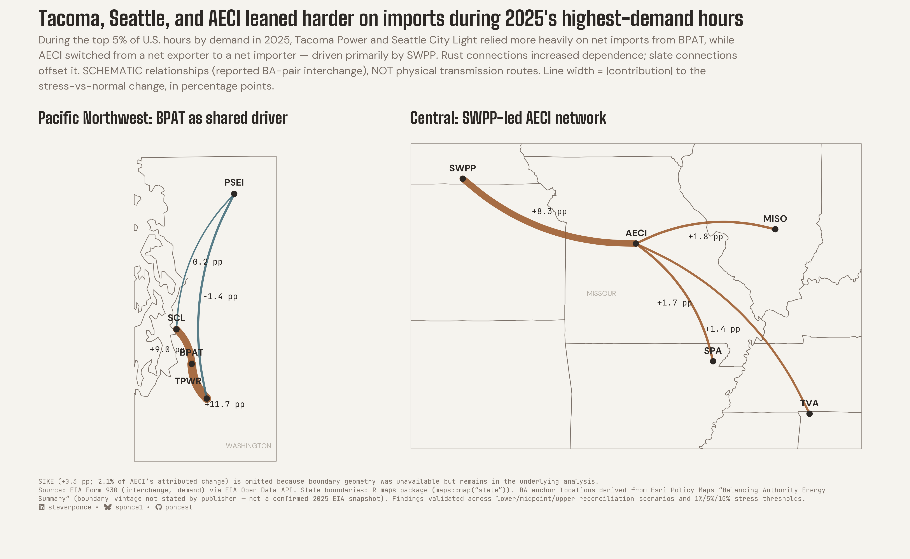

# EIA Grid Dependence, 2025

**During the highest-demand U.S. hours of 2025, Tacoma Power and Seattle City Light relied more heavily on net imports from BPAT, while AECI switched from net exporter to net importer, driven primarily by SWPP.**



**Read the piece:** [post](https://stevenponce.netlify.app/projects/standalone_visualizations/sa_2026-09-19.html)
**Definitions and validation results:** [`docs/DATA_DICTIONARY.md`](docs/DATA_DICTIONARY.md) and the tables in [`output/`](output/)

---

## What this project is about

The U.S. power grid is not one system. It is dozens of balancing authorities (BAs), the organizations that keep generation and demand in balance for their area, and they continuously trade power with their neighbors. This project asks a narrow question:

> When demand across the Lower 48 is at its highest, do some balancing authorities lean harder on their neighbors than they normally do, and which neighbor is doing the heavy lifting?

The goal is to explore **grid interdependence under demand stress** and to identify the specific BA-to-BA relationships behind any change. The analysis was designed to make those findings testable rather than merely descriptive, using reconciliation scenarios, alternative stress thresholds and event-based sensitivity checks.

### Key terms

| Term | Meaning here |
|---|---|
| **Balancing authority (BA)** | The entity responsible for matching generation to demand in its area and scheduling power exchanges with neighbors. Identified by short codes (BPAT, SWPP, AECI, ...). |
| **Interchange** | Reported hourly power exchange between a pair of BAs. |
| **Net import dependence** | Net imports as a share of the BA's own demand: `max(0, (incoming MWh − outgoing MWh) ÷ demand MWh)`. Computed as a ratio of sums within each season × hour-of-day stratum, separately for stress and normal hours. A stratum where the BA is a net exporter counts as 0. |
| **Exporter-to-importer flip** | Detected with the signed version of the same ratio (no floor at zero): net exporter or balanced in normal hours (≤ 0) and net importer in stress hours (> 0). |
| **Stress-vs-normal change** | Stress value minus normal value, combined across strata with fixed stratum weights (script 07), expressed in percentage points. Hour of day is defined in UTC. |
| **Stress hours** | The top 5% of hours by Lower 48 (US48) system-wide demand in 2025 (438 hours). This is an operational definition made for this project, not an official EIA term. |
| **pp (percentage points)** | Unit for the stress-vs-normal change in dependence, and for each neighbor's contribution to it. |

## Key findings

| Balancing authority | Finding | Main driver | Robustness |
|---|---|---|---|
| Tacoma Power (TPWR) | Net import dependence increased | BPAT (89.2% of total corridor contribution) | Robust |
| Seattle City Light (SCL) | Net import dependence increased | BPAT (97.6%) | Robust |
| AECI | Switched from net exporter to net importer | SWPP (61.7%; top three neighbors 87.7%) | Robust |

"Robust" is a fixed, pre-set rule (script 10). The finding must hold in the baseline top-5% comparison, in all three reconciliation scenarios, at all three stress thresholds (1%, 5% and 10%), and when partially observed flows are included. Named extreme-weather windows are also tested, but as an informational flag (`EVENT_VARIABLE`) rather than a pass/fail gate, because three short event windows are a much smaller sample than a percentile definition. The leading BPAT and SWPP corridors also remained #1 across all reconciliation scenarios.

**Event-window caveat.** All three headline findings carry the `EVENT_VARIABLE` flag: the claim held in fewer than two of the three short named-event windows. The result is therefore about the top 5% of U.S. demand hours across 2025, not about any particular heat wave or cold snap, and this project does not claim that these BAs behaved the same way in any specific named event.

*Corridor shares* are each neighbor's absolute contribution divided by the sum of all neighbors' absolute contributions. Contributions are computed on the signed net import ratio and approximately sum to the node's total; the gap is reported in `output/corridor_attribution_summary.csv`.

Other candidates were investigated and are recorded in `output/candidate_verdicts.csv`. GCPD, PNM and PSCO showed exporter-to-importer flips that did not survive alternative stress thresholds, so none is a headline claim.

## Data sources

**Analytical data:** U.S. Energy Information Administration (EIA), **Form EIA-930, Hourly and Daily Balancing Authority Operations Report**, accessed through the EIA Open Data API.

- Hourly BA-to-BA **interchange**, calendar year 2025
- Hourly **demand** for the Lower 48 (US48) system and for individual BAs and regions (83 series requested; coverage is uneven, see limitations)

**Geographic context (separate from the analytical data, used only to draw the chart):**

| Source | Role |
|---|---|
| EIA Form EIA-930 (Open Data API) | Interchange and demand analysis |
| Esri Policy Maps, "Balancing Authority Energy Summary" polygon layer ([ArcGIS FeatureServer, layer 31](https://services8.arcgis.com/peDZJliSvYims39Q/arcgis/rest/services/Balancing_Authorities_Summary/FeatureServer/31)) | Derive and validate BA anchor locations: polygons repaired, projected to EPSG:5070, and anchors chosen by comparing centroids with points-on-surface (`analysis/12`) |
| R `maps` package, `state` database | The visible state-boundary background in the final chart (`analysis/13`) |

The Esri layer (service item ID `b7821f7c9ce14fabb47e3fcae6a35c77`) states no description, copyright text or vintage on its REST endpoint, and its data are refreshed continuously (last edited September 2026 when checked), so it is **not** treated as a confirmed 2025 EIA snapshot. It affects only where nodes sit on the schematic map, not any analytical result.

Source fields and the key analytical tables are documented in [`docs/DATA_DICTIONARY.md`](docs/DATA_DICTIONARY.md). The remaining files in `data/` and `output/` are intermediate validation artifacts generated by the pipeline.

## Scope

**In scope**

- Comparing reliance on net imports during the top 5% of US48 demand hours with non-stress hours, stratified by season and time of day.
- Attributing each validated change to the individual neighbor (corridor) contributions behind it.
- Testing findings across different reconciliation choices, stress thresholds, flow-completeness assumptions and named-event windows.

**Out of scope (what this project does not measure or claim)**

- **Not a power-flow or transmission model.** EIA interchange records identify BA *pairs*, not transmission lines or tie points. The lines in the chart are schematic relationships, not physical routes.
- **Not a reliability assessment.** It does not measure generation adequacy, congestion, outages, prices, or operational performance. A BA importing more during high demand is normal grid behavior and is not, by itself, evidence of weakness.
- **Not causal.** Results are associations under the stress-versus-normal comparison defined here. The analysis does not attribute changes to weather, outages or market conditions.
- **Not comprehensive.** Findings cover the balancing authorities that passed the coverage and robustness gates, not every BA in the country.

## Analytical approach (short version)

1. Pull a full year of interchange data and reconcile the two reports each BA pair files about the same exchange, under lower/midpoint/upper scenarios.
2. Classify all 86 entities as balancing authority, regional aggregate or national aggregate, and build separate BA and region networks (never combined).
3. Define stress as the top 5% of US48 demand hours, and compare stress with normal hours within season × hour-of-day strata using ratio-of-sums, so like is compared with like.
4. Screen candidates against explicit data-quality gates, then test an 8-node candidate registry on five axes: stress threshold (1%/5%/10%), named extreme-weather events, reconciliation scenarios, flow completeness and regional coherence. Each candidate receives one verdict.
5. Decompose each validated finding into corridor contributions.

Formulas, gates and verdict rules are in [`docs/DATA_DICTIONARY.md`](docs/DATA_DICTIONARY.md); the scripts themselves are the full record.

## Assumptions and limitations

- **Interchange is reported BA-pair exchange**, not physical flow paths (see Scope).
- **Reciprocal reports disagree.** Each exchange is reported by both BAs and they do not always match; the analysis reconciles them and reports results under lower, midpoint and upper scenarios. 12 connections (7 BA-to-BA, 5 region-to-region) showed chronic disagreement.
- **Direction conflicts are excluded.** When the two BAs' reports disagree on the direction of flow in an hour, that connection-hour is dropped from the flow totals. Primary results use only node-hours where every active connection was resolved (`FULLY_OBSERVED`); including partially observed hours is one of the robustness tests.
- **Net import dependence is floored at zero,** so export periods contribute 0 rather than a negative value. Exporter-to-importer flips are analyzed separately with the signed ratio.
- **Hour of day is defined in UTC** for stratification. Stress and normal hours are treated identically, but strata do not map to local clock time.
- **Data-quality gates apply.** A node's result is a primary claim only if the stress hours retained after stratification cover at least 95% of stress weight, positive-demand coverage is at least 95%, and resolved-flow coverage is at least 90%.
- **Named-event windows do not confirm the headline findings.** The three named extreme-weather windows are short samples, so disagreement across them is flagged (`EVENT_VARIABLE`) rather than treated as disqualifying. TPWR, SCL and AECI are all flagged, so the findings should not be described as holding during specific weather events.
- **Stress is defined by this project** (top 5% of US48 demand hours), not by an official EIA or grid-operator definition. Alternative thresholds were tested.
- **Demand coverage is incomplete.** Of 83 demand series requested, 59 are complete, 7 near-complete, and 17 entities have no usable demand series (8 non-U.S. partners, 9 unverified as absent). This limits which candidates could be tested (for example, TVA sits near the coverage gate and is treated as secondary evidence).
- **BA and regional networks are analyzed separately** and never mixed.
- **Boundary vintage is unconfirmed for 2025.** It affects only chart geography (anchor placement), not the analytical results.
- **SIKE is analyzed but not drawn.** It contributes +0.3 pp (2.1% of AECI's attributed change) but no boundary geometry was available for it. It stays in the analysis tables.
- **Findings are based on one year (2025).** Whether the pattern repeats in other years was not tested.

## Repository structure

```
analysis/    Numbered scripts, run in order (01-13)
  01-03      Frozen one-day diagnostics (API validation, reconciliation logic)
  04-08      Data acquisition, reconciliation, network tables, stress definition, demand coverage
  09-11      Story discovery, robustness testing, corridor attribution
  12-13      Geography, chart prototype, final styled chart
R/           Shared helpers (brand fonts, theme, social caption icons)
output/      Validation tables, robustness results, corridor attribution, verdicts
figures/     Final chart and geometry prototypes
docs/        Data dictionary
data-raw/    Raw API pulls (not tracked; rebuilt by the scripts)
data/        Cached intermediate tables (not tracked; rebuilt by the scripts)
```

## Reproducibility

1. Register for a free EIA API key and store it in `.Renviron` as `EIA_API_KEY` (never commit it). The data-pull helper is `R/eia_api.R`, which stops with an error if the variable is not set.
2. Run the scripts in `analysis/` in numeric order. Scripts 04, 07 and 08 pull from the API; 04 is resumable, so an interrupted run picks up where it left off.
3. Install the required packages (the `tidyverse` covers `dplyr`, `tidyr`, `ggplot2`, `purrr`, `stringr`, `tibble`, `lubridate` and `readr`):
   ```r
   install.packages(c(
     "tidyverse", "arrow", "fs", "ggtext", "here", "httr2", "janitor",
     "maps", "patchwork", "sf", "showtext"
   ))
   ```
   Package versions are not pinned. `sf` needs the GDAL, GEOS and PROJ system libraries, which the standard macOS and Windows binaries include.
4. Fonts (Big Shoulders, DM Sans, JetBrains Mono) are downloaded from Google Fonts at render time, so the final chart needs network access. The social-icon row also needs the Font Awesome Free 6.6.0 brands font: download it from Font Awesome and place `Font Awesome 6 Brands-Regular-400.otf` in `fonts/6.6.0/` (the font files are not committed; without the file, `R/fonts.R` warns and the icon row is skipped).

## License and attribution

- **Data:** EIA content is a U.S. government work in the public domain. EIA asks that reuse carry an acknowledgment such as "Source: U.S. Energy Information Administration". The EIA logo is a registered trademark and is not used here. See EIA's [Copyrights and Reuse](https://www.eia.gov/about/copyrights_reuse.php) page.
- **Geographic sources:** State boundaries come from the `maps` R package. BA anchor locations were derived from the Esri Policy Maps "Balancing Authority Energy Summary" layer ([item page](https://www.arcgis.com/home/item.html?id=b7821f7c9ce14fabb47e3fcae6a35c77)), which states that it is licensed under the Esri Master License Agreement. That layer's geometry is not redistributed in this repository (`data/` is not tracked), and Esri-sourced material is not covered by the licenses below.
- **Code** (`analysis/`, `R/`, and `docs/*.R`): MIT License, see [`LICENSE`](LICENSE).
- **Written material and figures** (this README, `docs/*.md`, `figures/`): [CC BY 4.0](https://creativecommons.org/licenses/by/4.0/). Please credit Steven Ponce.

## Author

Steven Ponce
